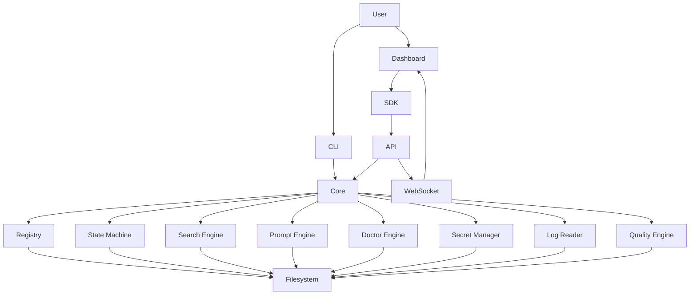
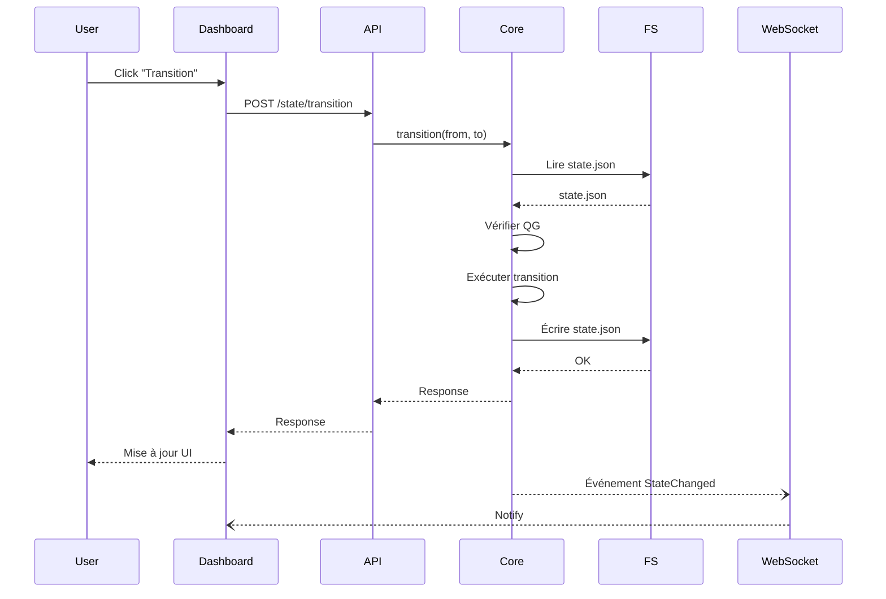

# 01 — Système Architecture

## 1. Vision de l'architecture

L'architecture d'AKORIS Control Center repose sur une séparation stricte entre :

- **Le Core Engine** : unique détenteur de la logique métier (règles, transitions, calculs, indexation). Indépendant de toute interface.
- **Les interfaces** : CLI, API, Dashboard, SDK. Elles se contentent d'échanger avec le Core et de présenter les résultats.

Cette séparation garantit que :

- La logique métier est testable indépendamment des interfaces.
- Les interfaces peuvent évoluer ou être remplacées sans impacter le Core.
- Les règles de gouvernance sont uniques et centralisées.

---

## 2. Bounded Contexts (Domaines métier)

L'architecture fonctionnelle est découpée en **5 contextes métier** (Domain-Driven Design), chacun ayant une responsabilité claire et des frontières explicites.

| Contexte | Responsabilité | Modules associés | Événements produits |
|----------|----------------|------------------|---------------------|
| **Registry** | Gestion du référentiel de gouvernance (agents, règles, capacités, livrables, QG) | Registry Explorer, Agent Catalog | `RegistryReloaded`, `AgentUpdated` |
| **State Machine** | Cycle de vie du projet : états, transitions, validation des Quality Gates | Project, Executive (état) | `StateChanged`, `TransitionDenied`, `GatePassed`, `GateFailed` |
| **Search** | Indexation et recherche fédérée dans toutes les sources (agents, règles, ADR, logs) | Command Palette, Search Bar | `SearchCompleted` |
| **AI Studio** | Construction de prompts, injection de contexte, test LLM, gestion des templates | AI Studio (modules) | `PromptExecuted`, `PromptSaved`, `LLMResponseReceived` |
| **DevOps** | Gestion des secrets, supervision des services connectés, orchestration des déploiements | DevOps (modules) | `DeploymentStarted`, `DeploymentFinished`, `SecretUpdated` |
| **Observability** | Logs, événements, notifications, timeline | Logs Live, Notifications, Timeline | `LogEmitted`, `NotificationCreated`, `TimelineUpdated` |

### Règles de frontières

- **Un contexte ne dépend jamais d'un autre contexte** directement. Les interactions se font via des **événements** ou via le **Core**.
- **Les données partagées** (ex: un agent) sont définies une seule fois dans le Registry et référencées partout.
- **Un module peut appartenir à un seul contexte** (ex: `Registry Explorer` est dans `Registry`, `State Machine` est dans `State Machine`).

---

## 3. Flux métier principaux

### Flux 1 : Transition d'état (Dashboard)

```
[Dashboard] → [Command Palette] → [API /state/transition] → [Core.StateMachine] → [Validation QG] → [Core.StateMachine] → [API Response] → [Dashboard]
                                                                                     │
                                                                                     ▼
                                                                          [WebSocket /events]
                                                                                     │
                                                                                     ▼
                                                                          [Dashboard] (Timeline, Notifications)
```

**Description** :
1. L'utilisateur exécute une transition via la Command Palette (`state transition --from Draft --to Planned`).
2. L'API transmet la demande au Core (StateMachineEngine).
3. Le Core vérifie les Quality Gates requis.
4. Si validé, la transition est exécutée, le nouvel état est persistant dans `.akoris/state.json`.
5. Un événement `StateChanged` est émis via WebSocket.
6. Le Dashboard met à jour l'affichage (machine à états, Timeline, notification).

---

### Flux 2 : Recherche fédérée (Dashboard)

```
[Dashboard] → [Search Bar] → [API /search] → [Core.SearchEngine] → [Indexation en mémoire] → [API Response] → [Dashboard]
```

**Description** :
1. L'utilisateur saisit un terme de recherche dans la barre (ou la Command Palette).
2. L'API appelle le SearchEngine du Core.
3. Le SearchEngine parcourt les sources (agents, règles, ADR, logs, etc.) en mémoire.
4. Les résultats sont regroupés par type et retournés au Dashboard.
5. Le Dashboard affiche les résultats.

---

### Flux 3 : Génération de prompt (AI Studio)

```
[Dashboard] → [Sélection agent] → [Context Builder] → [Prompt Builder] → [LLM Playground] → [API /prompt/execute] → [Core.PromptEngine] → [Appel LLM] → [Core] → [API Response] → [Dashboard]
```

**Description** :
1. L'utilisateur sélectionne un agent (ex: `DEV-04`).
2. Il coche les éléments de contexte (ADR, Registry, Logs récents, etc.).
3. Le PromptEngine génère un prompt structuré.
4. L'utilisateur peut tester le prompt sur un LLM (OpenAI, Anthropic).
5. La réponse est affichée dans l'interface.
6. L'utilisateur peut sauvegarder le prompt dans la Prompt Library.

---

## 4. Dépendances

### Diagramme des dépendances (Couches)

```
┌─────────────────────────────────────────────────────────────────────┐
│                         Interfaces                                  │
│  ┌─────────────┐  ┌─────────────┐  ┌─────────────┐  ┌──────────┐ │
│  │ Dashboard   │  │ CLI         │  │ SDK         │  │ API      │ │
│  │ (React)     │  │ (Commander) │  │ (TypeScript)│  │ (Fastify)│ │
│  └─────────────┘  └─────────────┘  └─────────────┘  └──────────┘ │
│         │                │                │              │         │
│         └────────────────┼────────────────┼──────────────┘         │
│                          │                │                        │
│                          ▼                ▼                        │
│  ┌──────────────────────────────────────────────────────────────┐ │
│  │                      Core Engine                             │ │
│  │  ┌─────────────┐  ┌─────────────┐  ┌───────────────────┐   │ │
│  │  │ Registry    │  │ State       │  │ Search Engine     │   │ │
│  │  │ Reader      │  │ Machine     │  │                   │   │ │
│  │  └─────────────┘  └─────────────┘  └───────────────────┘   │ │
│  │  ┌─────────────┐  ┌─────────────┐  ┌───────────────────┐   │ │
│  │  │ Prompt      │  │ Doctor      │  │ Secret Manager    │   │ │
│  │  │ Engine      │  │ Engine      │  │                   │   │ │
│  │  └─────────────┘  └─────────────┘  └───────────────────┘   │ │
│  │  ┌─────────────┐  ┌─────────────┐  ┌───────────────────┐   │ │
│  │  │ Alias       │  │ Log Reader  │  │ Quality Engine    │   │ │
│  │  │ Manager     │  │             │  │ (future)          │   │ │
│  │  └─────────────┘  └─────────────┘  └───────────────────┘   │ │
│  └──────────────────────────────────────────────────────────────┘ │
│                          │                                        │
│                          ▼                                        │
│  ┌──────────────────────────────────────────────────────────────┐ │
│  │                     Filesystem (Registry, .akoris/)          │ │
│  └──────────────────────────────────────────────────────────────┘ │
└─────────────────────────────────────────────────────────────────────┘
```

### Règles de dépendances

1. **Le Core ne dépend de rien** (sauf Node.js natif et le filesystem).
2. **L'API dépend du Core**, du SDK (pour les types) et de Fastify.
3. **Le Dashboard dépend du SDK** (et indirectement de l'API).
4. **Le SDK dépend des types partagés** (`packages/shared`).
5. **Le CLI dépend du Core** (et non plus de ses propres services).

**Aucune interface ne peut accéder directement au filesystem.** Tout accès aux données doit passer par le Core.

---

## 5. Diagrammes

### 5.1 Diagramme de composants (Mermaid)



---

### 5.2 Diagramme de flux (transition d'état)



---

## 6. Cohérence avec la Vision

- **Le Core est unique et indépendant** (conformément au principe #1 de la vision).
- **Le Dashboard délègue toute action au Core** (principe #3).
- **Les flux sont traçables** (principe #4).
- **Les frontières sont claires** (principe #8).
- **Le temps réel est utilisé** uniquement là où il apporte une valeur (logs, notifications) (principe #10).

---

## 7. Conclusion

Cette architecture répond aux exigences de la vision :

- **Visibilité** : Le Dashboard offre une vue unifiée.
- **Pilotage** : Les actions passent par le Core, garantissant l'intégrité des règles.
- **Évolutivité** : De nouvelles interfaces peuvent être ajoutées sans toucher au Core.
- **Maintenabilité** : La séparation des contextes permet des modifications ciblées.

Les prochains documents (notamment `02-technical-architecture.md` et `03-core.md`) détailleront les choix techniques et les interfaces publiques.

---

**Prochaine étape** : Validation de `01-system-architecture.md`, puis rédaction de `02-technical-architecture.md`.
