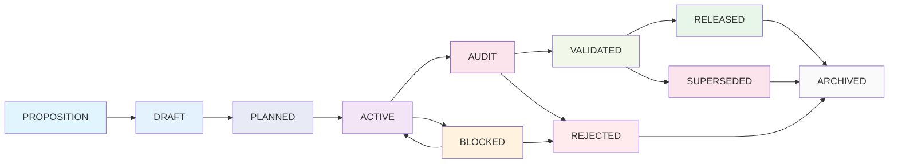

# Cycle de vie AKORIS — Diagramme

```mermaid
graph LR
    P[PROPOSITION] --> D[DRAFT]
    D --> PL[PLANNED]
    PL --> A[ACTIVE]
    A --> AU[AUDIT]
    AU --> V[VALIDATED]
    V --> R[RELEASED]
    R --> AR[ARCHIVED]
    
    A --> B[BLOCKED]
    B --> A
    B --> REJ[REJECTED]
    AU --> REJ
    V --> S[SUPERSEDED]
    
    REJ --> AR
    S --> AR

    style P fill:#e1f5fe
    style D fill:#e3f2fd
    style PL fill:#e8eaf6
    style A fill:#f3e5f5
    style AU fill:#fce4ec
    style V fill:#f1f8e9
    style R fill:#e8f5e9
    style AR fill:#fafafa
    style B fill:#fff3e0
    style REJ fill:#ffebee
    style S fill:#fce4ec
```