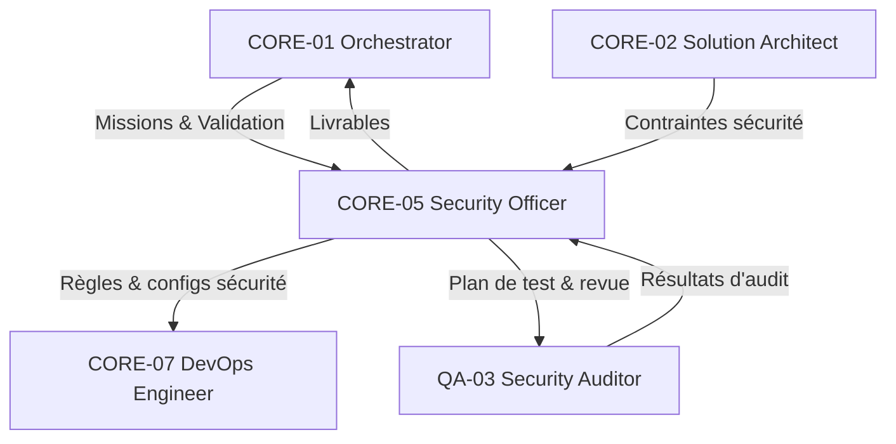

# Dependency Flow — CORE-05 Security Officer

```mermaid
flowchart TD
    CORE01["CORE-01 Orchestrator"] -->|"Missions & Validation"| CORE05["CORE-05 Security Officer"]
    CORE02["CORE-02 Solution Architect"] -->|"Contraintes sécurité"| CORE05
    CORE05 -->|"Règles & configs sécurité"| CORE07["CORE-07 DevOps Engineer"]
    CORE05 -->|"Plan de test & revue"| QA03["QA-03 Security Auditor"]
    QA03 -->|"Résultats d'audit"| CORE05
    CORE05 -->|"Livrables"| CORE01
```
