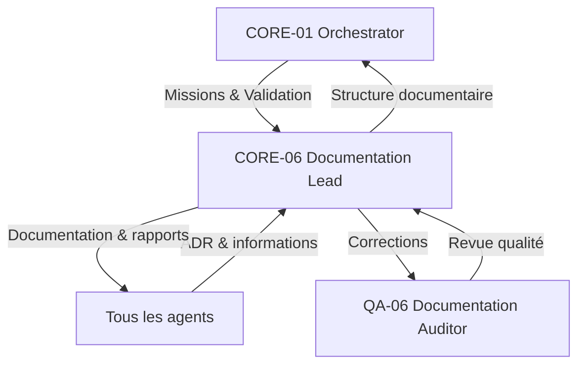

# Dependency Flow — CORE-06 Documentation Lead

```mermaid
flowchart TD
    CORE01["CORE-01 Orchestrator"] -->|"Missions & Validation"| CORE06["CORE-06 Documentation Lead"]
    ALL["Tous les agents"] -->|"ADR & informations"| CORE06
    CORE06 -->|"Documentation & rapports"| ALL
    CORE06 -->|"Structure documentaire"| CORE01
    QA06["QA-06 Documentation Auditor"] -->|"Revue qualité"| CORE06
    CORE06 -->|"Corrections"| QA06
```
