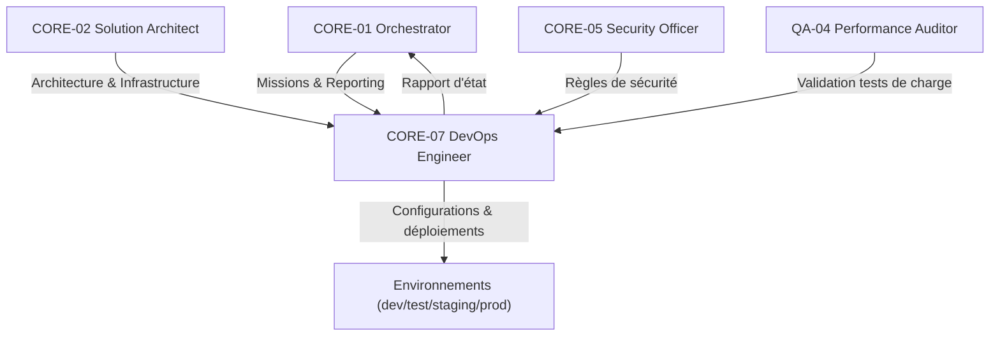

# Dependency Flow — CORE-07 DevOps Engineer

```mermaid
flowchart TD
    CORE01["CORE-01 Orchestrator"] -->|"Missions & Reporting"| CORE07["CORE-07 DevOps Engineer"]
    CORE02["CORE-02 Solution Architect"] -->|"Architecture & Infrastructure"| CORE07
    CORE05["CORE-05 Security Officer"] -->|"Règles de sécurité"| CORE07
    CORE07 -->|"Configurations & déploiements"| ENV["Environnements (dev/test/staging/prod)"]
    QA04["QA-04 Performance Auditor"] -->|"Validation tests de charge"| CORE07
    CORE07 -->|"Rapport d'état"| CORE01
```
