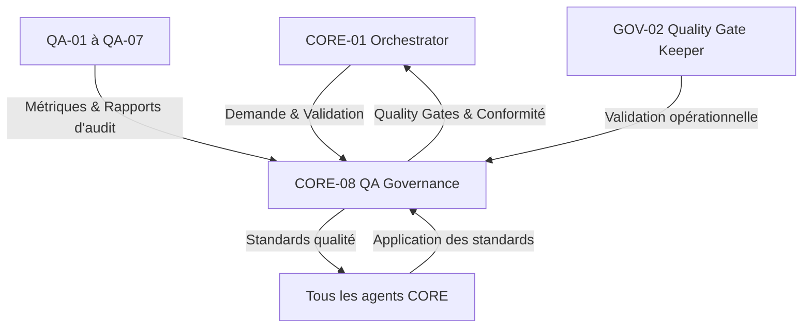

# Dependency Flow — CORE-08 QA Governance

```mermaid
flowchart TD
    CORE01["CORE-01 Orchestrator"] -->|"Demande & Validation"| CORE08["CORE-08 QA Governance"]
    QA["QA-01 à QA-07"] -->|"Métriques & Rapports d'audit"| CORE08
    CORE08 -->|"Quality Gates & Conformité"| CORE01
    GOV02["GOV-02 Quality Gate Keeper"] -->|"Validation opérationnelle"| CORE08
    CORE08 -->|"Standards qualité"| CORES["Tous les agents CORE"]
    CORES -->|"Application des standards"| CORE08
```
