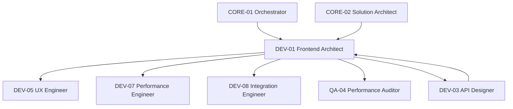

# Diagramme — DEV-01 Frontend Architect

## Flux principal
1. Réception des spécifications UI/UX (DEV-05)
2. Conception de l'arbre de composants et routing
3. Définition du design system
4. Implémentation de la stratégie de state management
5. Optimisation des performances (DEV-07, QA-04)
6. Validation des appels API (DEV-08)
