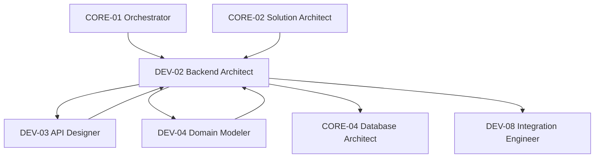

# Diagramme — DEV-02 Backend Architect

## Flux principal
1. Réception des spécifications fonctionnelles et user stories
2. Définition de l'architecture backend globale
3. Découpage en services et modules
4. Conception des patterns d'intégration
5. Validation avec DEV-03 (contrats API) et DEV-04 (domaine)
6. Coordination avec CORE-04 (persistence)
