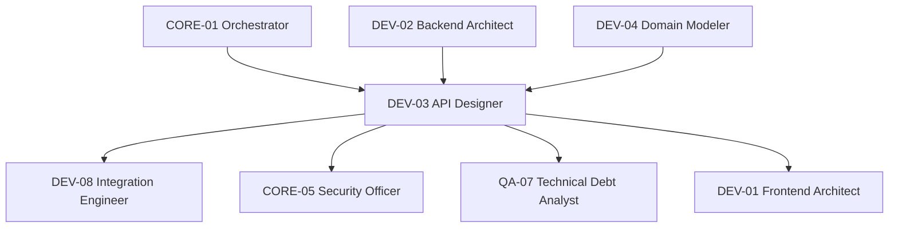

# Diagramme — DEV-03 API Designer

## Flux principal
1. Réception de l'architecture backend (DEV-02) et du modèle de domaine (DEV-04)
2. Design des endpoints REST/GraphQL
3. Rédaction des spécifications OpenAPI
4. Définition de la stratégie de versioning
5. Validation des schémas de sécurité (CORE-05)
6. Tests de contrat automatisés
