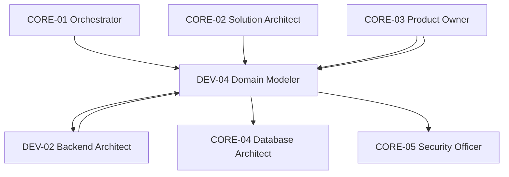

# Diagramme — DEV-04 Domain Modeler

## Flux principal
1. Réception des spécifications métier et user stories (CORE-03)
2. Analyse et modélisation du domaine avec DDD
3. Définition des agrégats, entités et objets de valeur
4. Identification des bounded contexts
5. Conduite d'ateliers Event Storming
6. Formalisation des règles métier invariantes
7. Transmission à DEV-02 (services) et CORE-04 (persistence)
