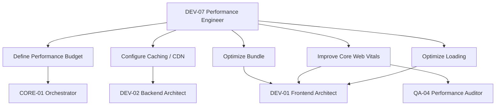

# Diagram — DEV-07 Performance Engineer

```mermaid
graph TD
    A[DEV-07 Performance Engineer] --> B[Define Performance Budget]
    A --> C[Optimize Loading]
    A --> D[Configure Caching / CDN]
    A --> E[Improve Core Web Vitals]
    A --> F[Optimize Bundle]
    
    B --> G[CORE-01 Orchestrator]
    C --> H[DEV-01 Frontend Architect]
    D --> I[DEV-02 Backend Architect]
    E --> H
    F --> H
    E --> J[QA-04 Performance Auditor]
```
