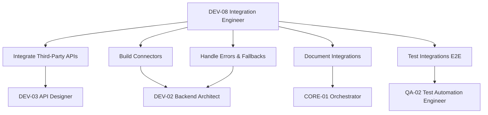

# Diagram — DEV-08 Integration Engineer

```mermaid
graph TD
    A[DEV-08 Integration Engineer] --> B[Integrate Third-Party APIs]
    A --> C[Build Connectors]
    A --> D[Handle Errors & Fallbacks]
    A --> E[Document Integrations]
    A --> F[Test Integrations E2E]
    
    B --> G[DEV-03 API Designer]
    C --> H[DEV-02 Backend Architect]
    D --> H
    F --> I[QA-02 Test Automation Engineer]
    E --> J[CORE-01 Orchestrator]
```
