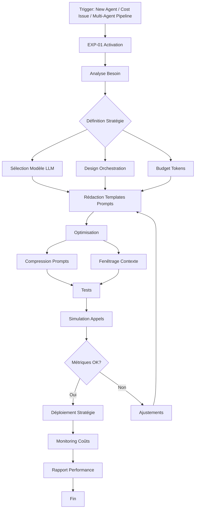

# Workflow — EXP-01 AI Orchestration Expert

```mermaid
flowchart TD
    A[Trigger: New Agent / Cost Issue / Multi-Agent Pipeline] --> B[EXP-01 Activation]
    B --> C[Analyse Besoin]
    C --> D{Définition Stratégie}
    D --> E[Sélection Modèle LLM]
    D --> F[Design Orchestration]
    D --> G[Budget Tokens]
    E & F & G --> H[Rédaction Templates Prompts]
    H --> I[Optimisation]
    I --> J[Compression Prompts]
    I --> K[Fenêtrage Contexte]
    J & K --> L[Tests]
    L --> M[Simulation Appels]
    M --> N{Métriques OK?}
    N -->|Oui| O[Déploiement Stratégie]
    N -->|Non| P[Ajustements]
    P --> H
    O --> Q[Monitoring Coûts]
    Q --> R[Rapport Performance]
    R --> S[Fin]
```
