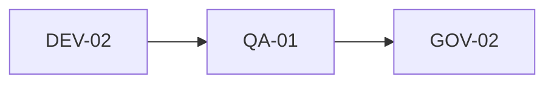

# Usage Example — EXP-01: Optimisation d'une session multi-agents

## Contexte
CORE-01 requiert l'orchestration de 3 agents (DEV-02, QA-01, GOV-02) pour générer un module backend avec tests et validation qualité.

## Besoin
- Budget max: 15 000 tokens
- Modèle recommandé: GPT-4o-mini pour rédaction, GPT-4o pour relecture critique
- Temps max: 2 minutes par étape

## Stratégie d'orchestration



1. **DEV-02** génère le code (modèle: GPT-4o-mini, budget: 6000 tokens)
2. **QA-01** review le code (modèle: GPT-4o, budget: 5000 tokens)
3. **GOV-02** valide la qualité (modèle: GPT-4o-mini, budget: 3000 tokens)

## Template de prompt transmis à DEV-02
```markdown
Tu es DEV-02, Backend Architect.
Génère un module NestJS pour la gestion des utilisateurs avec:
- CRUD complet
- Validation DTO
- Tests unitaires (Jest)
Respecte les conventions du projet.
```

## Résultat
- Coût total: 12 400 tokens (sous le budget)
- Qualité sortie: 9/10 (validé par QA-04)
- Temps total: 3 min 45 sec
