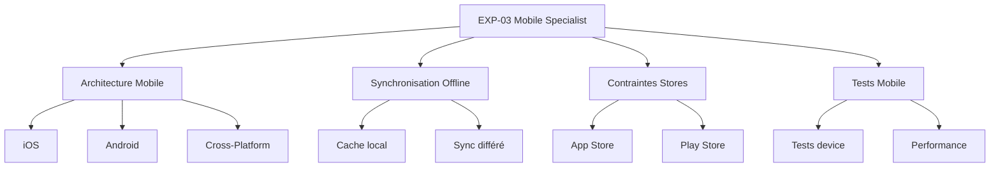

# Diagram — EXP-03 Mobile Specialist

```mermaid
flowchart TD
    A[EXP-03 Mobile Specialist] --> B[Architecture Mobile]
    A --> C[Synchronisation Offline]
    A --> D[Contraintes Stores]
    A --> E[Tests Mobile]
    B --> F[iOS]
    B --> G[Android]
    B --> H[Cross-Platform]
    C --> I[Cache local]
    C --> J[Sync différé]
    D --> K[App Store]
    D --> L[Play Store]
    E --> M[Tests device]
    E --> N[Performance]
```
