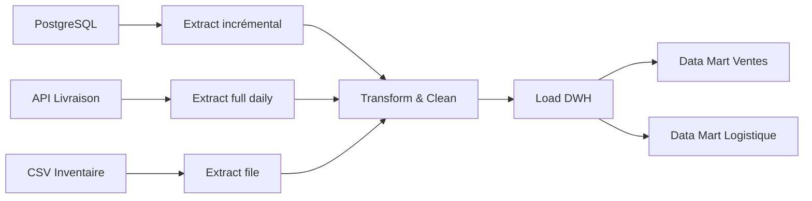

# Usage Example — EXP-04: Pipeline analytics pour plateforme e-commerce

## Contexte
Plateforme e-commerce avec données de ventes, utilisateurs et inventaire. Besoin d'un data warehouse pour rapports quotidiens (CORE-03).

## Sources de données
- PostgreSQL transactionnel (CORE-04) — Ventes, clients, produits
- API externe — Données de livraison
- Fichiers CSV — Inventaire fournisseurs (quotidien)

## Pipeline ETL



## Modèle dimensionnel (star schema)

```sql
-- Table de faits
CREATE TABLE dw.fact_ventes (
    id_vente UUID,
    id_client INT,
    id_produit INT,
    id_date INT,
    montant DECIMAL,
    quantite INT
);

-- Dimensions
CREATE TABLE dw.dim_client (...);
CREATE TABLE dw.dim_produit (...);
CREATE TABLE dw.dim_date (...);
```

## Qualité des données
- Complétude: 99.8%
- Exactitude: 99.95%
- Pipeline fiable à 99.5% sur 30 jours
- Latence: H+0.5 (en dessous du SLA H+1)

## Résultat
- Dashboard ventes J-1 disponible chaque matin à 6h30
- Catalogue de données documenté avec lignage complet
- Alertes qualité configurées sur Slack
