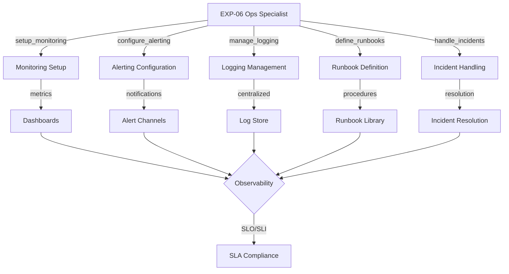

```mermaid
flowchart TD
    EXP06[EXP-06 Ops Specialist]
    
    EXP06 -->|setup_monitoring| MON[Monitoring Setup]
    EXP06 -->|configure_alerting| ALT[Alerting Configuration]
    EXP06 -->|manage_logging| LOG[Logging Management]
    EXP06 -->|define_runbooks| RUN[Runbook Definition]
    EXP06 -->|handle_incidents| INC[Incident Handling]
    
    MON -->|metrics| DSH[Dashboards]
    ALT -->|notifications| NOT[Alert Channels]
    LOG -->|centralized| LOK[Log Store]
    RUN -->|procedures| RBT[Runbook Library]
    INC -->|resolution| FIX[Incident Resolution]
    
    DSH --> OBS{Observability}
    NOT --> OBS
    LOK --> OBS
    RBT --> OBS
    FIX --> OBS

    OBS -->|SLO/SLI| SLA[SLA Compliance]
```
