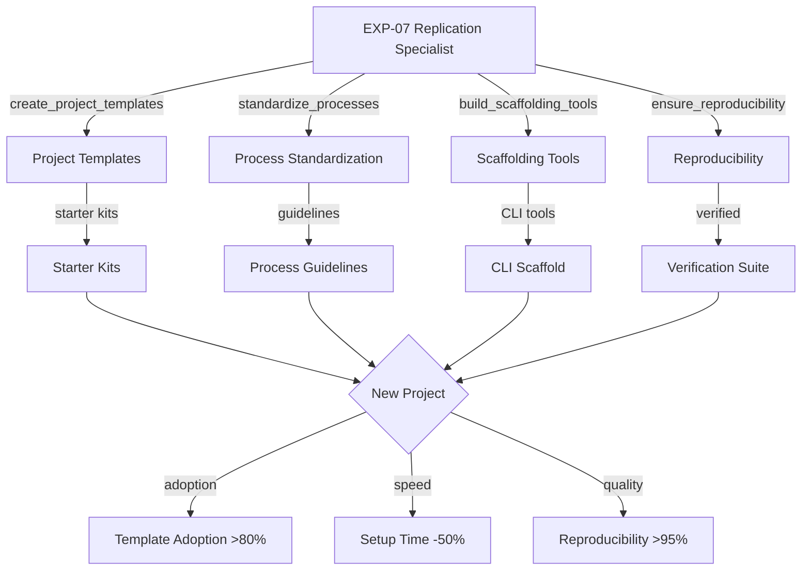

```mermaid
flowchart TD
    EXP07[EXP-07 Replication Specialist]
    
    EXP07 -->|create_project_templates| TPL[Project Templates]
    EXP07 -->|standardize_processes| STD[Process Standardization]
    EXP07 -->|build_scaffolding_tools| SCF[Scaffolding Tools]
    EXP07 -->|ensure_reproducibility| REP[Reproducibility]
    
    TPL -->|starter kits| KIT[Starter Kits]
    STD -->|guidelines| GUI[Process Guidelines]
    SCF -->|CLI tools| CLI[CLI Scaffold]
    REP -->|verified| VER[Verification Suite]
    
    KIT --> NEW{New Project}
    GUI --> NEW
    CLI --> NEW
    VER --> NEW
    
    NEW -->|adoption| ADOPT[Template Adoption >80%]
    NEW -->|speed| SPEED[Setup Time -50%]
    NEW -->|quality| SCORE[Reproducibility >95%]
```
