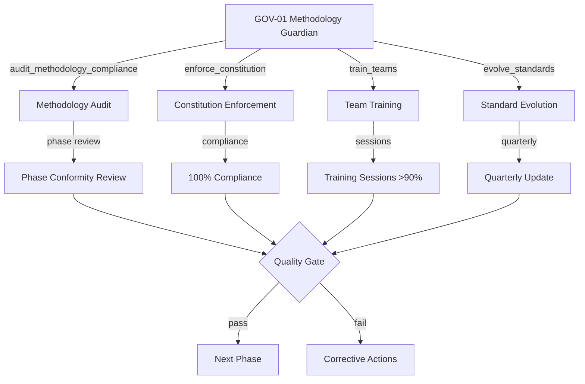

```mermaid
flowchart TD
    GOV01[GOV-01 Methodology Guardian]
    
    GOV01 -->|audit_methodology_compliance| AUD[Methodology Audit]
    GOV01 -->|enforce_constitution| ENF[Constitution Enforcement]
    GOV01 -->|train_teams| TRN[Team Training]
    GOV01 -->|evolve_standards| EVO[Standard Evolution]
    
    AUD -->|phase review| REV[Phase Conformity Review]
    ENF -->|compliance| CMP[100% Compliance]
    TRN -->|sessions| SES[Training Sessions >90%]
    EVO -->|quarterly| QRT[Quarterly Update]
    
    REV --> GATE{Quality Gate}
    CMP --> GATE
    SES --> GATE
    QRT --> GATE
    
    GATE -->|pass| NEXT[Next Phase]
    GATE -->|fail| FIX[Corrective Actions]
```
