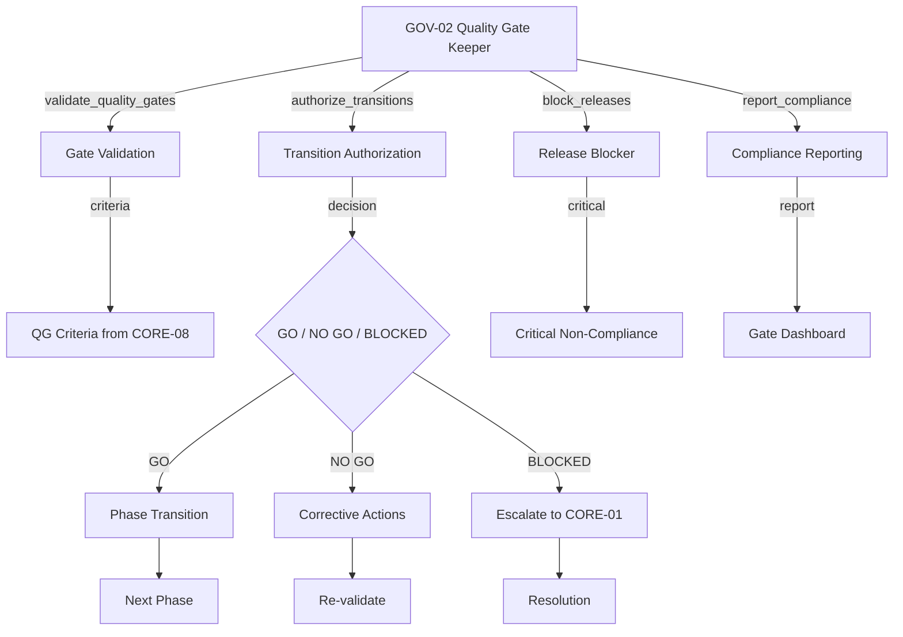

```mermaid
flowchart TD
    GOV02[GOV-02 Quality Gate Keeper]
    
    GOV02 -->|validate_quality_gates| VAL[Gate Validation]
    GOV02 -->|authorize_transitions| ATH[Transition Authorization]
    GOV02 -->|block_releases| BLK[Release Blocker]
    GOV02 -->|report_compliance| RPT[Compliance Reporting]
    
    VAL -->|criteria| CRT[QG Criteria from CORE-08]
    ATH -->|decision| DEC{GO / NO GO / BLOCKED}
    BLK -->|critical| CRIT[Critical Non-Compliance]
    RPT -->|report| DSH[Gate Dashboard]
    
    DEC -->|GO| PASS[Phase Transition]
    DEC -->|NO GO| HOLD[Corrective Actions]
    DEC -->|BLOCKED| ESC[Escalate to CORE-01]
    
    PASS --> NEXT[Next Phase]
    HOLD --> RETRY[Re-validate]
    ESC --> RES[Resolution]
```
