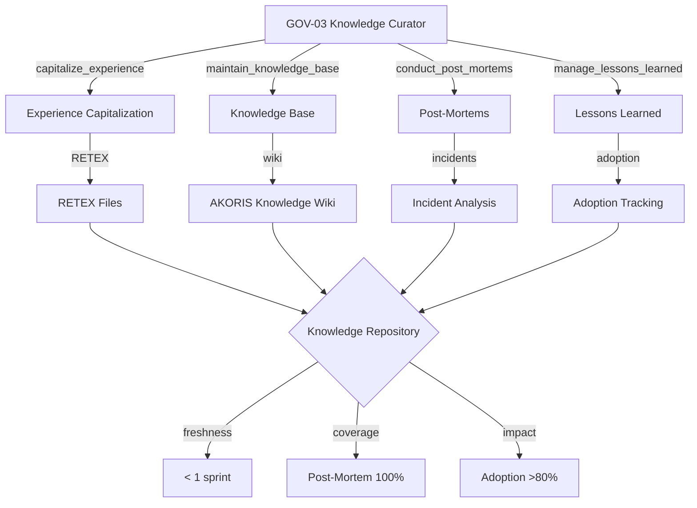

```mermaid
flowchart TD
    GOV03[GOV-03 Knowledge Curator]
    
    GOV03 -->|capitalize_experience| CAP[Experience Capitalization]
    GOV03 -->|maintain_knowledge_base| KBS[Knowledge Base]
    GOV03 -->|conduct_post_mortems| PM[Post-Mortems]
    GOV03 -->|manage_lessons_learned| LSN[Lessons Learned]
    
    CAP -->|RETEX| RTX[RETEX Files]
    KBS -->|wiki| WIK[AKORIS Knowledge Wiki]
    PM -->|incidents| INC[Incident Analysis]
    LSN -->|adoption| ADP[Adoption Tracking]
    
    RTX --> KNOW{Knowledge Repository}
    WIK --> KNOW
    INC --> KNOW
    ADP --> KNOW
    
    KNOW -->|freshness| FRESH[< 1 sprint]
    KNOW -->|coverage| COV[Post-Mortem 100%]
    KNOW -->|impact| IMP[Adoption >80%]
```
