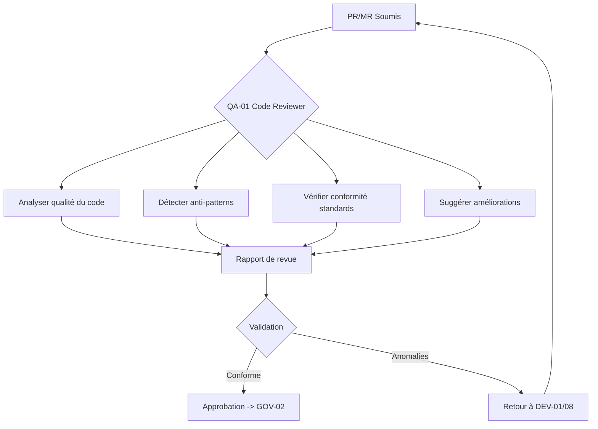

```mermaid
flowchart TD
    A[PR/MR Soumis] --> B{QA-01 Code Reviewer}
    B --> C[Analyser qualité du code]
    B --> D[Détecter anti-patterns]
    B --> E[Vérifier conformité standards]
    B --> F[Suggérer améliorations]
    C --> G[Rapport de revue]
    D --> G
    E --> G
    F --> G
    G --> H{Validation}
    H -->|Conforme| I[Approbation -> GOV-02]
    H -->|Anomalies| J[Retour à DEV-01/08]
    J --> A
```
