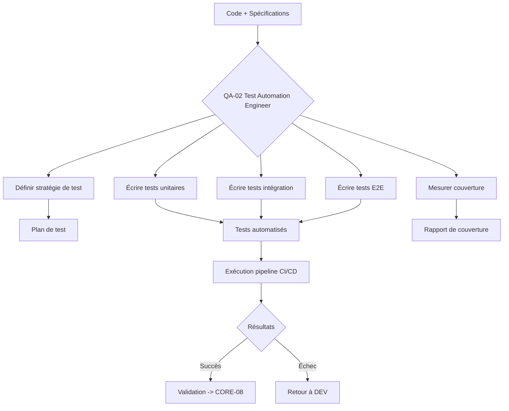

```mermaid
flowchart TD
    A[Code + Spécifications] --> B{QA-02 Test Automation Engineer}
    B --> C[Définir stratégie de test]
    B --> D[Écrire tests unitaires]
    B --> E[Écrire tests intégration]
    B --> F[Écrire tests E2E]
    B --> G[Mesurer couverture]
    C --> H[Plan de test]
    D --> I[Tests automatisés]
    E --> I
    F --> I
    G --> J[Rapport de couverture]
    I --> K[Exécution pipeline CI/CD]
    K --> L{Résultats}
    L -->|Succès| M[Validation -> CORE-08]
    L -->|Échec| N[Retour à DEV]
```
