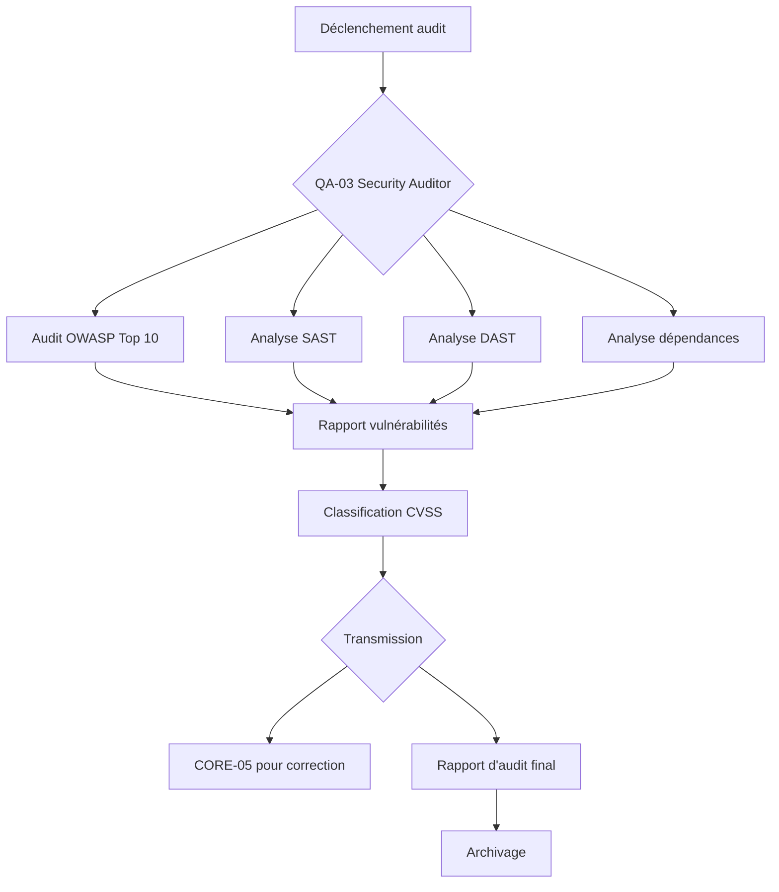

```mermaid
flowchart TD
    A[Déclenchement audit] --> B{QA-03 Security Auditor}
    B --> C[Audit OWASP Top 10]
    B --> D[Analyse SAST]
    B --> E[Analyse DAST]
    B --> F[Analyse dépendances]
    C --> G[Rapport vulnérabilités]
    D --> G
    E --> G
    F --> G
    G --> H[Classification CVSS]
    H --> I{Transmission}
    I --> J[CORE-05 pour correction]
    I --> K[Rapport d'audit final]
    K --> L[Archivage]
```
