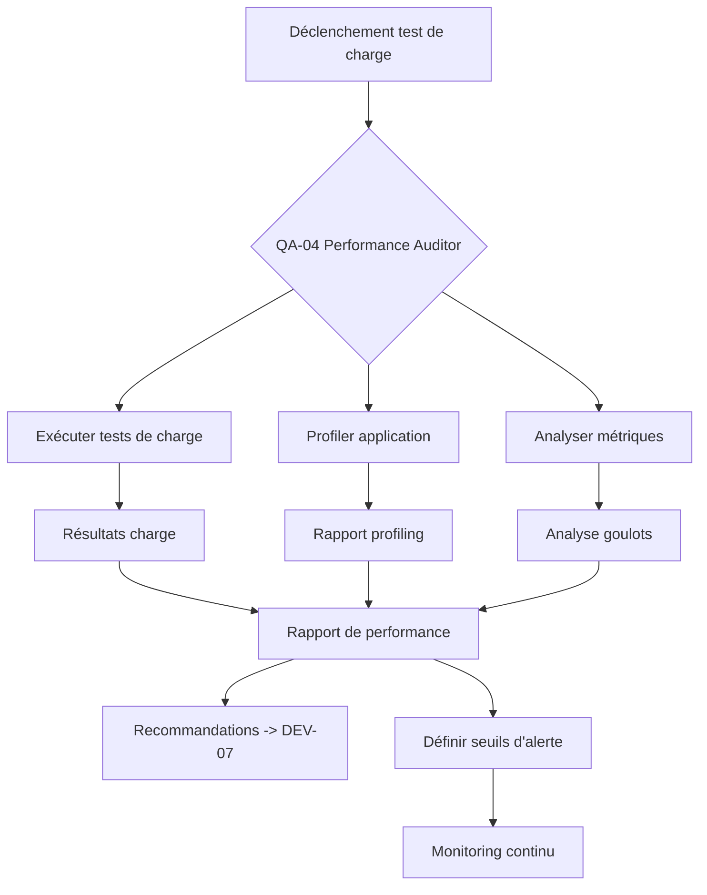

```mermaid
flowchart TD
    A[Déclenchement test de charge] --> B{QA-04 Performance Auditor}
    B --> C[Exécuter tests de charge]
    B --> D[Profiler application]
    B --> E[Analyser métriques]
    C --> F[Résultats charge]
    D --> G[Rapport profiling]
    E --> H[Analyse goulots]
    F --> I[Rapport de performance]
    G --> I
    H --> I
    I --> J[Recommandations -> DEV-07]
    I --> K[Définir seuils d'alerte]
    K --> L[Monitoring continu]
```
