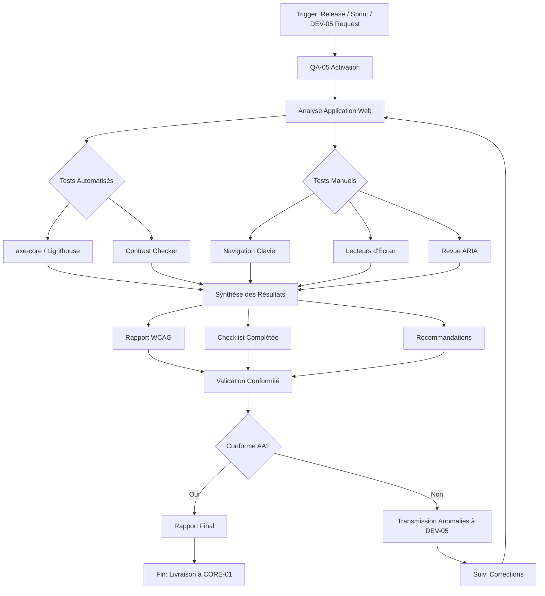

# Workflow — QA-05 Accessibility Auditor

```mermaid
flowchart TD
    A[Trigger: Release / Sprint / DEV-05 Request] --> B[QA-05 Activation]
    B --> C[Analyse Application Web]
    C --> D{Tests Automatisés}
    D --> E[axe-core / Lighthouse]
    D --> F[Contrast Checker]
    C --> G{Tests Manuels}
    G --> H[Navigation Clavier]
    G --> I[Lecteurs d'Écran]
    G --> J[Revue ARIA]
    E & F & H & I & J --> K[Synthèse des Résultats]
    K --> L[Rapport WCAG]
    K --> M[Checklist Complétée]
    K --> N[Recommandations]
    L & M & N --> O[Validation Conformité]
    O --> P{Conforme AA?}
    P -->|Oui| Q[Rapport Final]
    P -->|Non| R[Transmission Anomalies à DEV-05]
    R --> S[Suivi Corrections]
    S --> C
    Q --> T[Fin: Livraison à CORE-01]
```
