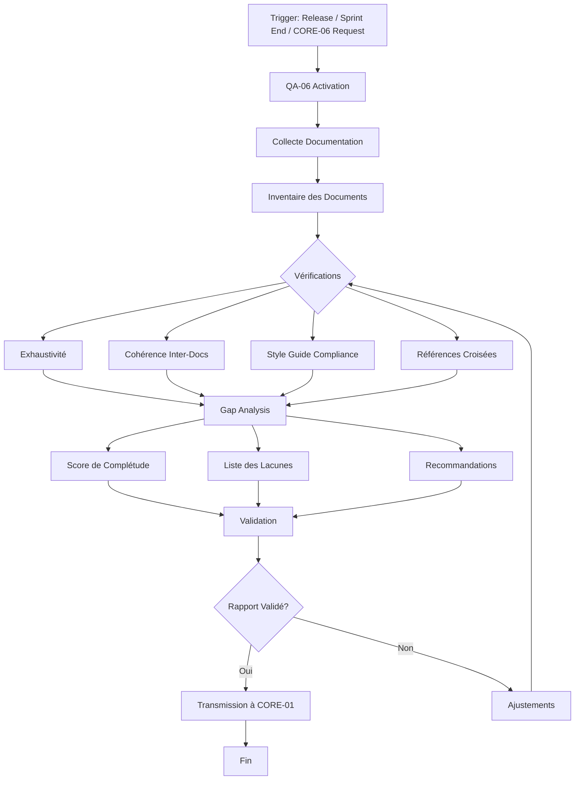

# Workflow — QA-06 Documentation Auditor

```mermaid
flowchart TD
    A[Trigger: Release / Sprint End / CORE-06 Request] --> B[QA-06 Activation]
    B --> C[Collecte Documentation]
    C --> D[Inventaire des Documents]
    D --> E{Vérifications}
    E --> F[Exhaustivité]
    E --> G[Cohérence Inter-Docs]
    E --> H[Style Guide Compliance]
    E --> I[Références Croisées]
    F & G & H & I --> J[Gap Analysis]
    J --> K[Score de Complétude]
    J --> L[Liste des Lacunes]
    J --> M[Recommandations]
    K & L & M --> N[Validation]
    N --> O{Rapport Validé?}
    O -->|Oui| P[Transmission à CORE-01]
    O -->|Non| Q[Ajustements]
    Q --> E
    P --> R[Fin]
```
