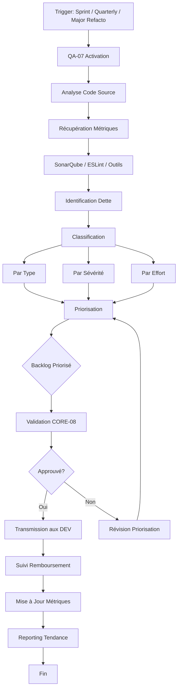

# Workflow — QA-07 Technical Debt Analyst

```mermaid
flowchart TD
    A[Trigger: Sprint / Quarterly / Major Refacto] --> B[QA-07 Activation]
    B --> C[Analyse Code Source]
    C --> D[Récupération Métriques]
    D --> E[SonarQube / ESLint / Outils]
    E --> F[Identification Dette]
    F --> G[Classification]
    G --> H[Par Type]
    G --> I[Par Sévérité]
    G --> J[Par Effort]
    H & I & J --> K[Priorisation]
    K --> L{Backlog Priorisé}
    L --> M[Validation CORE-08]
    M --> N{Approuvé?}
    N -->|Oui| O[Transmission aux DEV]
    N -->|Non| P[Révision Priorisation]
    P --> K
    O --> Q[Suivi Remboursement]
    Q --> R[Mise à Jour Métriques]
    R --> S[Reporting Tendance]
    S --> T[Fin]
```
