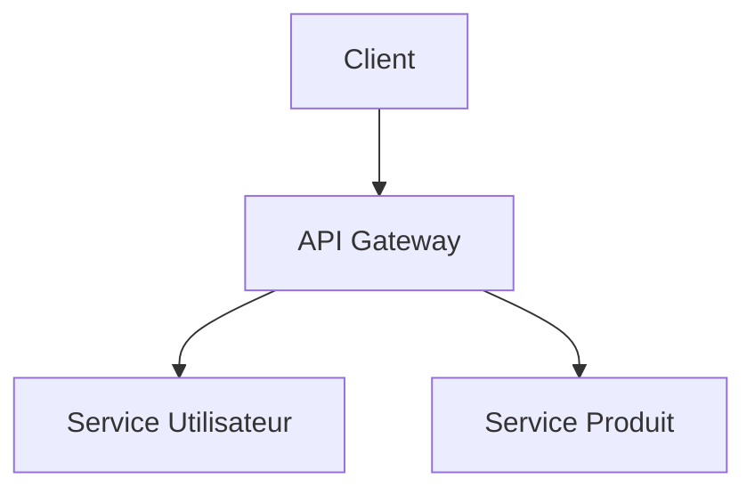

# Style Markdown

## Introduction

Ce document definit les regles de formatage Markdown pour tous les documents de l'organisation. Une documentation coherente ameliore la lisibilite et la maintenabilite.

## Regles generales

- Utiliser des fichiers `.md` uniquement.
- Encodage UTF-8 sans BOM.
- Fin de ligne en LF, pas CRLF.
- Pas d'espace en fin de ligne.
- Une ligne vide a la fin du fichier.
- Limiter les lignes a 120 caracteres maximum.

## Titres

- Un seul `#` (H1) par document, correspondant au titre principal.
- Respecter la hierarchie : ne pas sauter de niveau.
- Pas d'espace apres le `#` manquant : toujours un espace avant le texte.

```markdown
# Titre principal (H1)

## Section (H2)

### Sous-section (H3)

#### Sous-sous-section (H4)
```

## Listes

### Listes non ordonnees

Utiliser `-` comme marqueur. Pas de `*` ni `+`.

```markdown
- Element 1
- Element 2
  - Sous-element 2.1
  - Sous-element 2.2
- Element 3
```

### Listes ordonnees

Utiliser `1.` pour tous les elements. Le rendu sera correct.

```markdown
1. Premier element
1. Deuxieme element
1. Troisieme element
```

## Code

### Blocs de code

Toujours specifier le langage apres les trois backticks.

```markdown
```typescript
const message = "Bonjour";
```
```

### Code inline

Utiliser des backticks simples pour le code dans le texte : `variableName`.

## Liens

```markdown
[Texte du lien](chemin/vers/document.md)

[Lien vers une section](fichier.md#section)
```

## Images

Pas d'images dans la documentation technique sauf diagrammes d'architecture. Les diagrammes sont en format Mermaid ou PlantUML.

## Tableaux

```markdown
| Nom            | Type     | Description               |
|----------------|----------|---------------------------|
| `userId`       | string   | Identifiant de l'utilisateur |
| `isActive`     | boolean  | Statut d'activation       |
| `createdAt`    | Date     | Date de creation          |
```

- Toujours aligner les separateurs de colonnes.
- Toujours inclure une ligne de separation apres l'en-tete.
- Utiliser le formatage de code inline pour les noms de colonnes qui sont des identifiants.

## Fichiers de configuration

Utiliser des blocs de code avec le format adequat pour les fichiers de configuration :

```markdown
```json
{
  "compilerOptions": {
    "strict": true
  }
}
```
```

## Citations

```markdown
> Ceci est une citation.
> Elle peut contenir plusieurs lignes.
```

## Notes et avertissements

```markdown
> Note : Information importante a retenir.

> Attention : Risque potentiel a considerer.

> Danger : Impact critique sur la securite ou les donnees.
```

## Separateurs

Utiliser `---` pour les separateurs horizontaux. Toujours entoure d'une ligne vide avant et apres.

## Mermaid

Les diagrammes Mermaid sont preferes pour les schemas d'architecture :

```markdown

```

## Regles de redaction

- Utiliser la forme imperative pour les titres ("Creer un utilisateur", pas "Creation d'un utilisateur").
- Une idee par paragraphe.
- Utiliser des listes pour les series d'elements.
- Eviter le gras et l'italique excessifs.
- Les chemins de fichiers sont en code inline.
- Les touches de clavier sont entre chevrons : `<Enter>`, `<Ctrl+C>`.

## Frontmatter

Les documents longs peuvent inclure un frontmatter YAML :

```markdown
---
title: Titre du document
author: Equipe Architecture
date: 2026-07-25
version: 1.0.0
status: approuve
---
```

## Fichiers obligatoires

- `README.md` a la racine de chaque projet.
- `CONTRIBUTING.md` avec les regles de contribution.
- `CHANGELOG.md` suivant le format Keep a Changelog.
